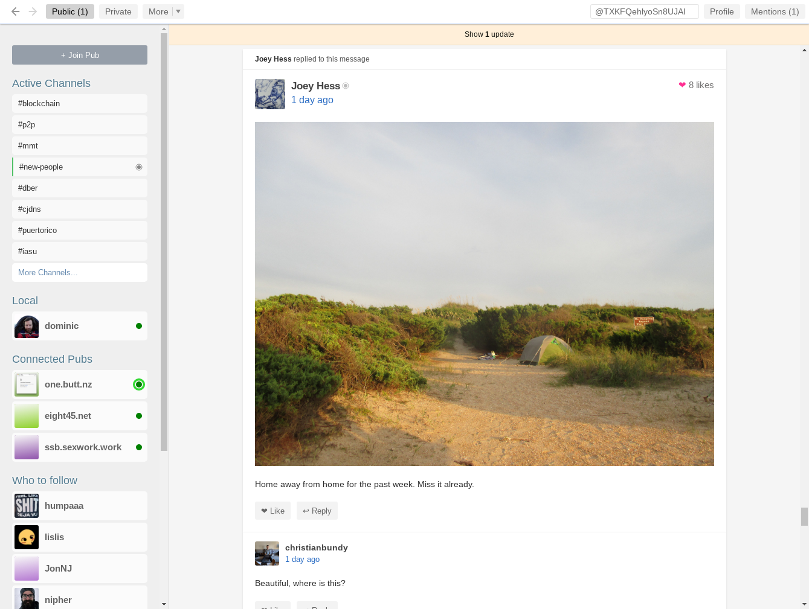
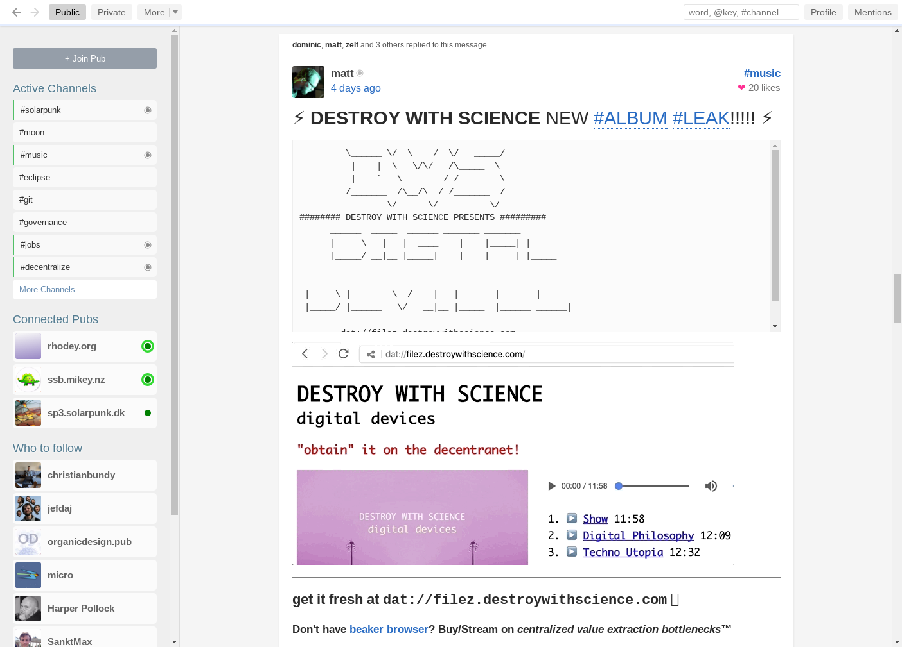
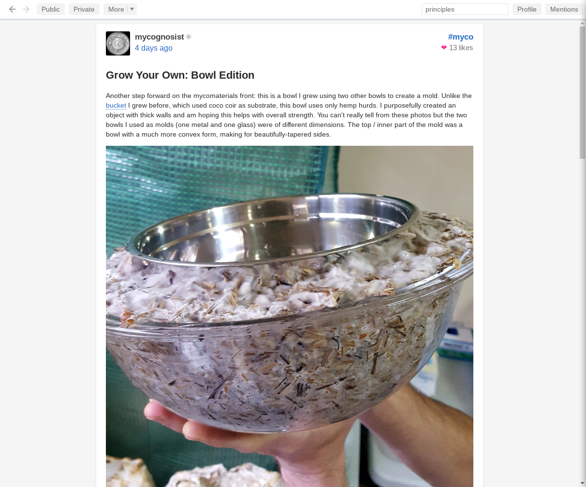
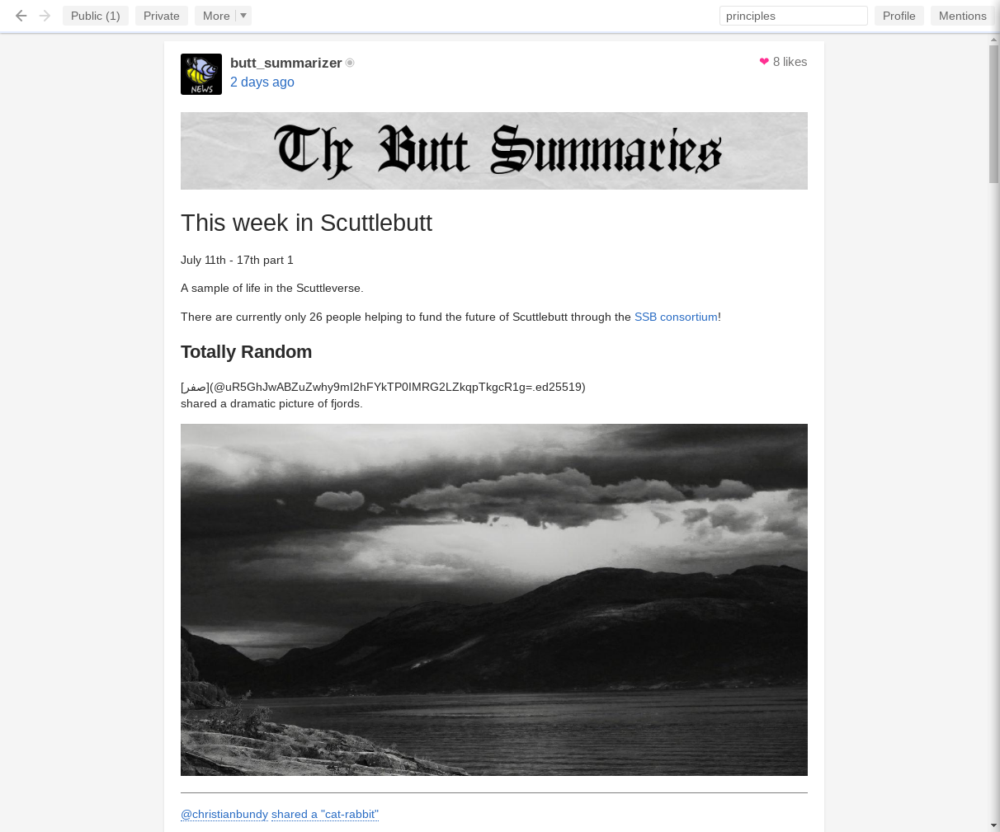
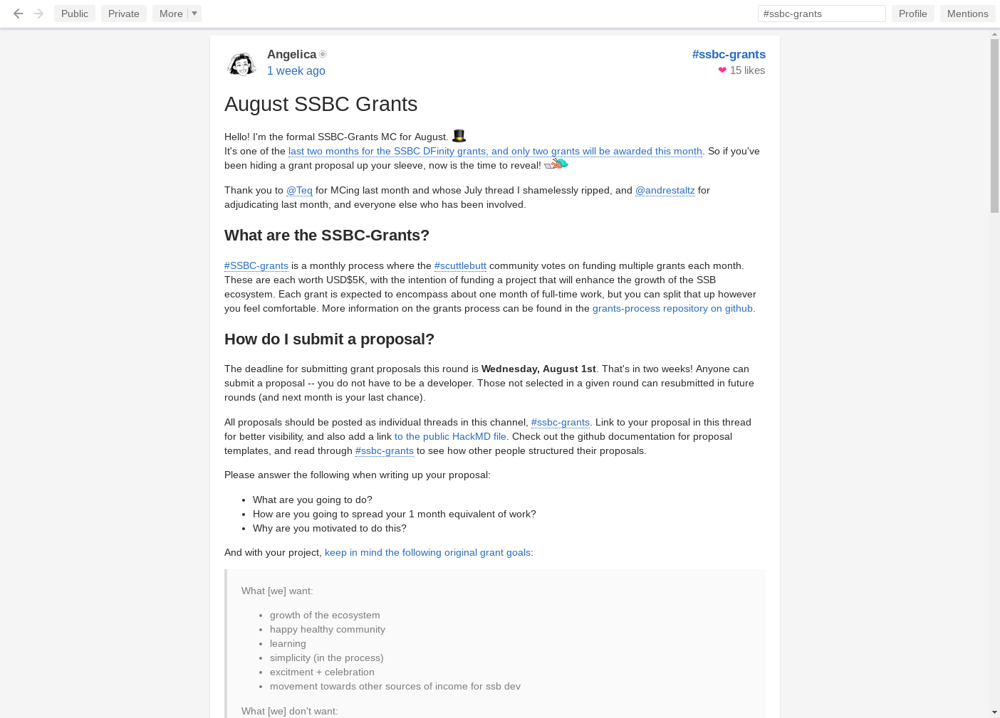
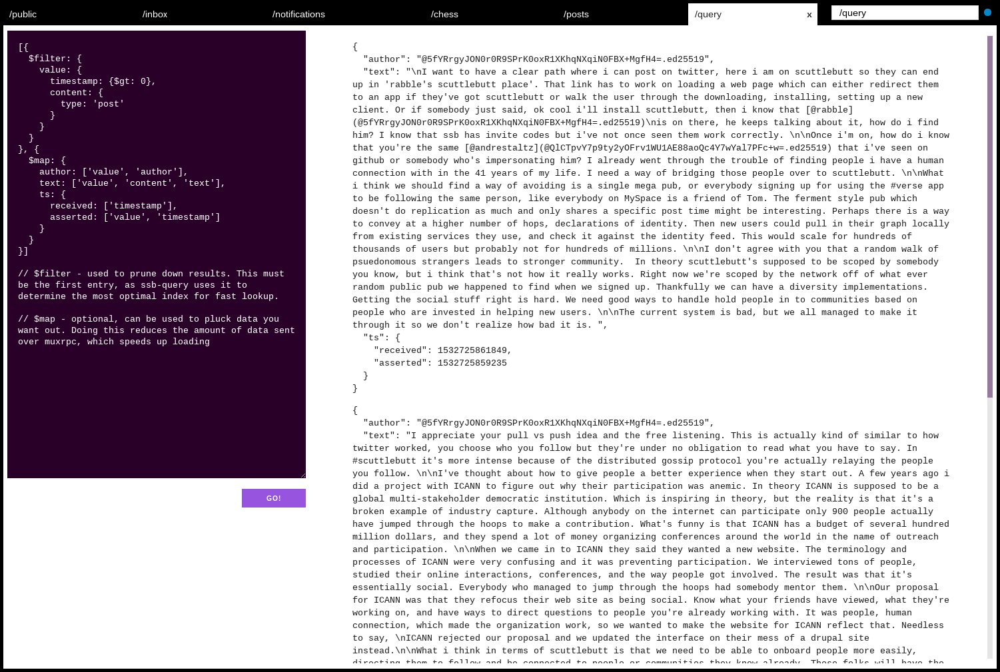
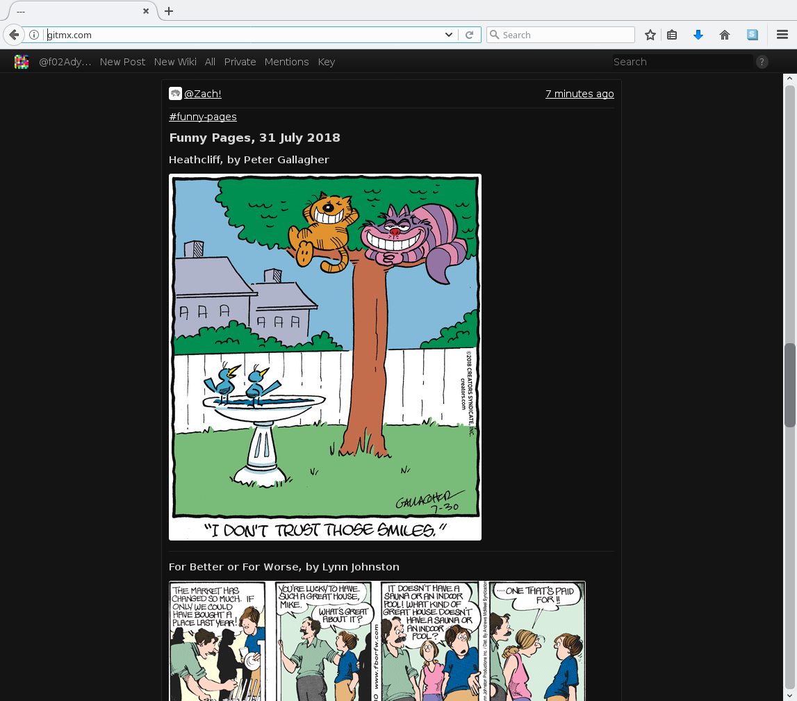

layout: true

<footer>dinosaur.is/dweb-2018</footer>

---
class: center

# a walk through the Scuttlebutt ecosystem

???

---
class: center

## hey [Decentralized Web Summit](https://decentralizedweb.net/)!

i'm [Mikey](http://dinosaur.is), also known as @dinosaur

([%+/B9AqweMoDZeF9rxlSwmHyTNy96N82OSIDdmchrN0M=.sha256](http://ssb.mikey.nz:8807/%25%2B%2FB9AqweMoDZeF9rxlSwmHyTNy96N82OSIDdmchrN0M%3D.sha256))

---
class: center, no-margin

([%b1pH4LZQ4hp2acS036eSBeKJbsSgDAkpovN2JRhv8fI=.sha256](https://viewer.scuttlebot.io/%25b1pH4LZQ4hp2acS036eSBeKJbsSgDAkpovN2JRhv8fI%3D.sha256)

???

- one identity, many interfaces

---
class: center, title

# app: Patchwork

GitHub: https://github.com/ssbc/patchwork

git-ssb: ssb://%bfG9dyXtlic9umNzgwYuG8nhjG0ycUrlBROprvyBZaU=.sha256

???

our "flagship" app

---
class: center, no-margin

([%YZZ4ZL2xDogZ266PBmgK3AMkX6te+ZrKgkdqN8J4tcM=.sha256](https://viewer.scuttlebot.io/%25YZZ4ZL2xDogZ266PBmgK3AMkX6te%2BZrKgkdqN8J4tcM%3D.sha256))

???

Joey goes camping!

---
class: center, no-margin

???

a standard social network, here's my profile

---
class: center, no-margin

???

supports private messages

---
class: center, no-margin

???

supports events (or gatherings), you might have heard about this gathering

---
class: center, no-margin

TODO video embeds

???

---
class: center, no-margin

TODO polls

???

---
class: center, no-margin

TODO tags

???

---
class: center, no-margin

([%h2jB8hwsoMMQiorytsd5f/IUH2dfWzdkPztWawK5Jqs=.sha256](https://viewer.scuttlebot.io/%25h2jB8hwsoMMQiorytsd5f%2FIUH2dfWzdkPztWawK5Jqs%3D.sha256))

???

sure okay, we implemented a decent(ralized) Facebook / Twitter, whatever

what's most interesting about Scuttlebutt is not our technical features

what's most interesting about Scuttlebutt is our decently active community and grassroots culture

if Conway's law is true: "organizations which design systems ... are constrained to produce designs which are copies of the communication structures of these organizations."

here's Matt, our local music artist, also the current lead maintainer of Patchwork, releasing a new music album!

---
class: center, no-margin

([%j5oHgt9J6HyeY3KounJtVeju6m49PhkNL011efZPx68=.sha256](https://viewer.scuttlebot.io/%25j5oHgt9J6HyeY3KounJtVeju6m49PhkNL011efZPx68%3D.sha256))

???

the latest in growable biomaterials

---
class: center, no-margin

???

tales from an eco village in Brazil

---
class: center, no-margin

([%AAmcEmYZWRSL/BxV2UjxQ2JCywI0LpNrFFOOhvXvKNE=.sha256](https://viewer.scuttlebot.io/%25AAmcEmYZWRSL%2FBxV2UjxQ2JCywI0LpNrFFOOhvXvKNE%3D.sha256))

???

a weekly digest about the latest happenings on the butts

---
class: center, no-margin

???

every day, the best comics

---
class: center, no-margin

???

this one's from almost 3 years ago, Dominic and Paul talking about a secure decentralized browser, you might have heard of it, now called Beaker Browser

---
class: center, no-margin

???

---
class: center, no-margin

???

---
class: center, title

# app: Patchbay

GitHub: https://github.com/ssbc/patchbay

git-ssb: ssb://%s9mSFATE4RGyJx9wgH22lBrvD4CgUQW4yeguSWWjtqc=.sha256

???

moving to the next ship sailing in our archeapalego: Patchbay

---
class: center, no-margin

???

here's Mix, the current lead maintainer

---
class: center, no-margin

???

---
class: center, no-margin

???

---
class: center, no-margin

???
---
class: center, no-margin

???
---
class: center, no-margin

???
---
class: center, no-margin

???

---

# app: mmmmmm

GitHub: 

---

# app: scuttle-shell

GitHub: https://github.com/ssbc/scuttle-shell

???

a cute system tray application for an always-running Scuttlebutt server

---

# app: patchfox

---

## app: patchless

---

## app: scat

GitHub: https://github.com/stripedpajamas/scat

---
class: center, no-margin

---

## app: stool

GitHub: https://github.com/stripedpajamas/stool

---
class: center, no-margin

---

## app: ngx 

---

## app: mvd

web: http://gitmx.com/

GitHub: https://github.com/evbogue/mvd

git-ssb-web: http://git-ssb.celehner.com/%25NPNNvcnTMZUFZSWl%2F2Z4XX%2BYSdqsqOhyPacp%2BlgpQUw%3D.sha256

git-ssb: ssb://%NPNNvcnTMZUFZSWl/2Z4XX+YSdqsqOhyPacp+lgpQUw=.sha256

---
class: center, no-margin

---

## lib: rust

---

### lib: go

---

## tool: graphviz

---

## tool: graphyz

---

## guide: Scuttlebutt protocol guide

https://ssbc.github.io/scuttlebutt-protocol-guide/

---

## guide: An Introduction to Scuttlebutt Development: Your Test Playground

https://josiahwitt.com/2018/07/08/scuttlebutt-intro-test-playground.html

dat://wittjosiah.hashbase.io/2018/07/08/scuttlebutt-intro-test-playground.html

---

## guide: An Introduction to Scuttlebutt Development: Flume & Plugins 

https://josiahwitt.com/2018/07/08/scuttlebutt-intro-flume.html

dat://wittjosiah.hashbase.io/2018/07/08/scuttlebutt-intro-flume.html

---

## guide: from GitHub to git-ssb

GitHub: https://github.com/noffle/git-ssb-intro

git-ssb-web: https://git-ssb.celehner.com/%25RPKzL382v2fAia5HuDNHD5kkFdlP7bGvXQApSXqOBwc%3D.sha256

git-ssb: ssb://%RPKzL382v2fAia5HuDNHD5kkFdlP7bGvXQApSXqOBwc=.sha256

---

## guide: sailing patchfoo

GitHub: https://github.com/noffle/sailing-patchfoo

---

## notes

- philosophy
  - single identity, many interfaces
- desktop apps
  - Patchwork
    - public post
      - #concept-art
      - #ssbc-grants
      - #gif-garden
      - #community-gardening
      - #solarpunk
    - private post
    - gatherings
      - Dweb 2018: %TfEnYBPjazXhFC64kJQsXjSpmp/fX79h0VrHGIA42To=.sha256
    - video
      - chandeledra: %/IjGTzNNnHVtJr7Momb3np+yWFYp7hJbnXWUcTcCAkA=.sha256
    - polls
    - tags
  - Patchbay
    - chess
    - image search
  - Patchfoo: https://github.com/noffle/sailing-patchfoo
    - emoji
  - Patchfox
  - scat
  - ngx
  - scuttle-shell
  - TickTack
  - mvb
- mobile apps
  - mmmmm
- tools
  - dnssb
  - git-ssb: https://github.com/noffle/git-ssb-intro
- libraries
  - javascript
    - electron starter
  - go
  - rust
- documentation
  - scuttlebutt.nz
  - scuttlebutt protocol guide: https://ssbc.github.io/scuttlebutt-protocol-guide/
  - josiah guides
- community
  - #ssbc-grants
