layout: true

<footer>

dinosaur.is/dweb-2018

</footer>

---
class: center

# a walk through the Scuttlebutt ecosystem

???

---
class: center

## hey [Decentralized Web Summit](https://decentralizedweb.net/)!

i'm [Mikey](http://dinosaur.is), also known as @dinosaur

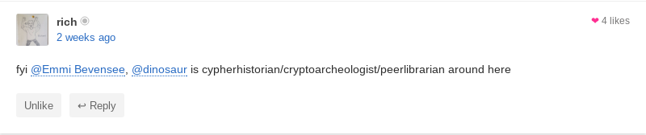

([%+/B9AqweMoDZeF9rxlSwmHyTNy96N82OSIDdmchrN0M=.sha256](http://ssb.mikey.nz:8807/%25%2B%2FB9AqweMoDZeF9rxlSwmHyTNy96N82OSIDdmchrN0M%3D.sha256))

---
class: center, no-margin

# get ready for a fire hose

---
class: center, no-margin

[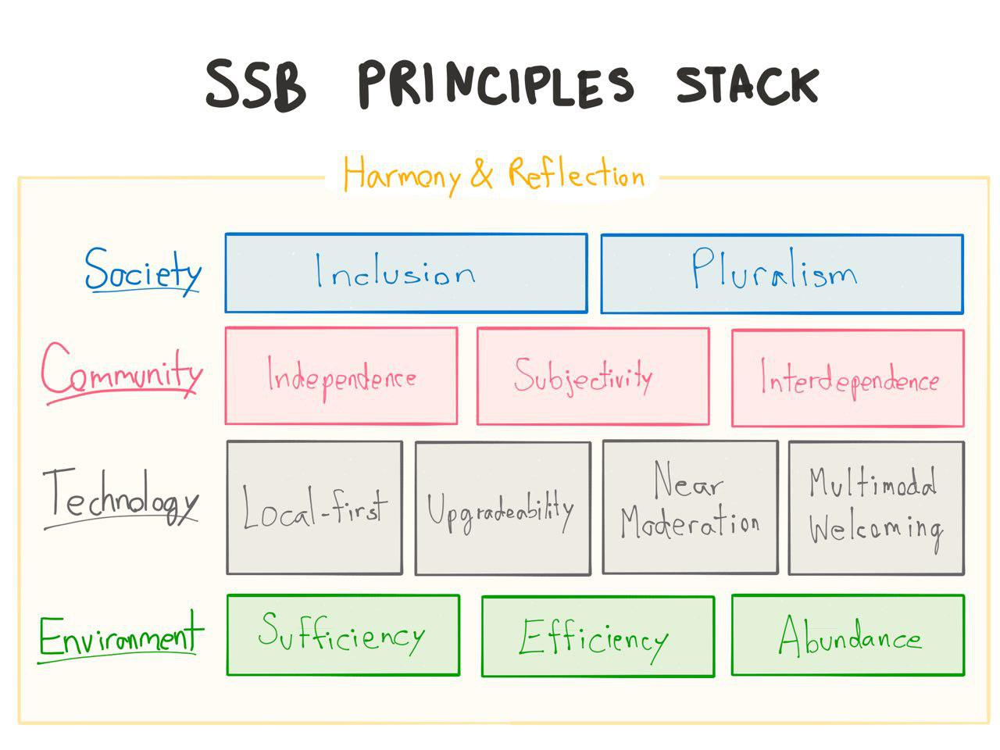](https://www.scuttlebutt.nz/principles/)

([%b1pH4LZQ4hp2acS036eSBeKJbsSgDAkpovN2JRhv8fI=.sha256](https://viewer.scuttlebot.io/%25b1pH4LZQ4hp2acS036eSBeKJbsSgDAkpovN2JRhv8fI%3D.sha256)

???

across everything you'll see, here's what's  held in common

- one identity, many interfaces

---
class: center, title

# app: Patchwork

GitHub: https://github.com/ssbc/patchwork

git-ssb: ssb://%bfG9dyXtlic9umNzgwYuG8nhjG0ycUrlBROprvyBZaU=.sha256

???

our "flagship" app

---
class: center, no-margin

### app: Patchwork

???

([%YZZ4ZL2xDogZ266PBmgK3AMkX6te+ZrKgkdqN8J4tcM=.sha256](https://viewer.scuttlebot.io/%25YZZ4ZL2xDogZ266PBmgK3AMkX6te%2BZrKgkdqN8J4tcM%3D.sha256))

Joey goes camping!

---
class: center, no-margin

### app: Patchwork

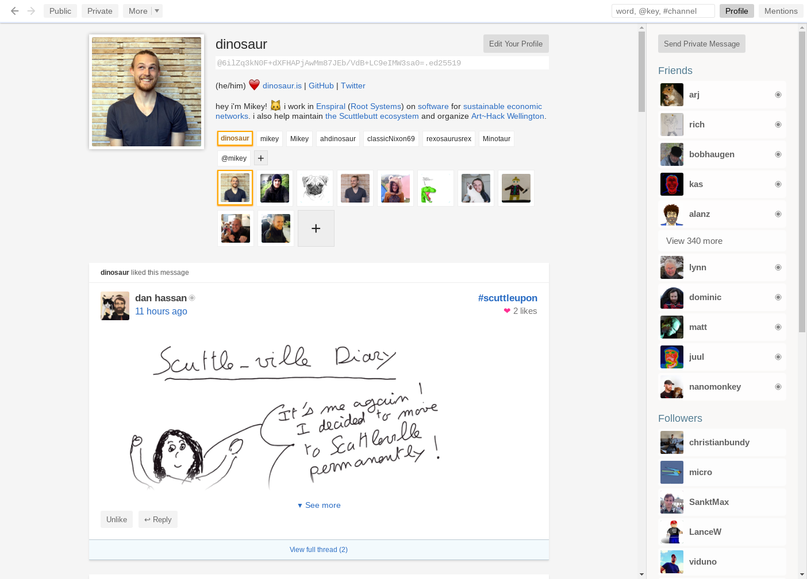

???

a standard social network, here's my profile

---
class: center, no-margin

### app: Patchwork

???

supports private messages

---
class: center, no-margin

### app: Patchwork

???

supports events (or gatherings), you might have heard about this gathering

---
class: center, no-margin

### app: Patchwork

???

---
class: center, no-margin

### app: Patchwork

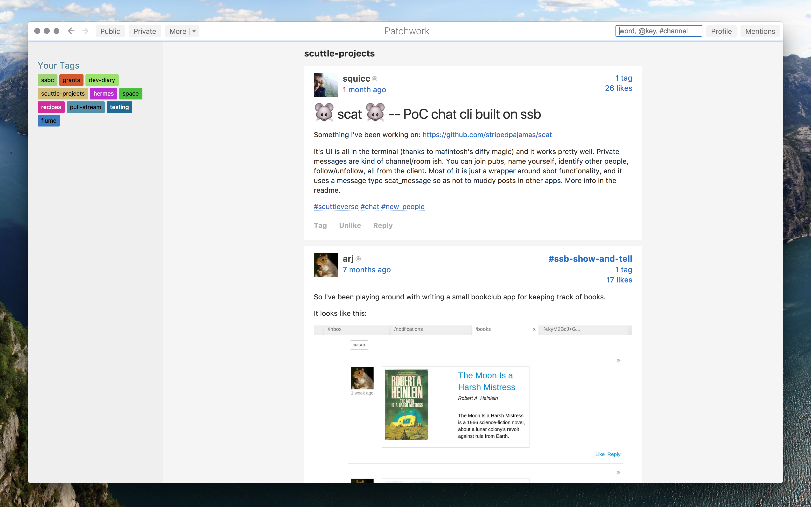

???

---
class: center, no-margin

### app: Patchwork

???

([%h2jB8hwsoMMQiorytsd5f/IUH2dfWzdkPztWawK5Jqs=.sha256](https://viewer.scuttlebot.io/%25h2jB8hwsoMMQiorytsd5f%2FIUH2dfWzdkPztWawK5Jqs%3D.sha256))

sure okay, we implemented a decent(ralized) Facebook / Twitter, whatever

what's most interesting about Scuttlebutt is not our technical features

what's most interesting about Scuttlebutt is our decently active community and grassroots culture

if Conway's law is true: "organizations which design systems ... are constrained to produce designs which are copies of the communication structures of these organizations."

here's Matt, our local music artist, also the current lead maintainer of Patchwork, releasing a new music album!

---
class: center, no-margin

### app: Patchwork

([%j5oHgt9J6HyeY3KounJtVeju6m49PhkNL011efZPx68=.sha256](https://viewer.scuttlebot.io/%25j5oHgt9J6HyeY3KounJtVeju6m49PhkNL011efZPx68%3D.sha256))

???

the latest in growable biomaterials

---
class: center, no-margin

### app: Patchwork

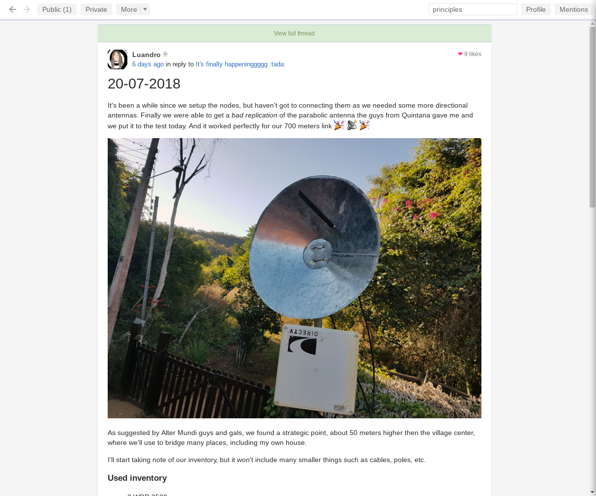

???

tales from an eco village in Brazil

---
class: center, no-margin

### app: Patchwork

([%AAmcEmYZWRSL/BxV2UjxQ2JCywI0LpNrFFOOhvXvKNE=.sha256](https://viewer.scuttlebot.io/%25AAmcEmYZWRSL%2FBxV2UjxQ2JCywI0LpNrFFOOhvXvKNE%3D.sha256))

???

a weekly digest about the latest happenings on the butts

---
class: center, no-margin

### app: Patchwork

???

every day, the best comics

---
class: center, no-margin

### app: Patchwork

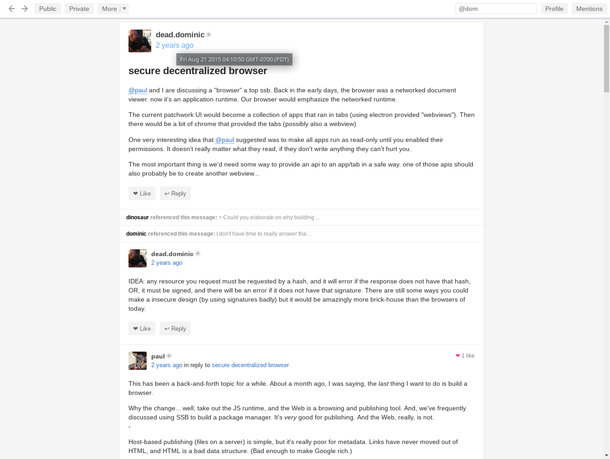

???

this one's from almost 3 years ago, Dominic and Paul talking about a secure decentralized browser, you might have heard of it, now called Beaker Browser

---
class: center, no-margin

### app: Patchwork

???

---
class: center, no-margin

### app: Patchwork

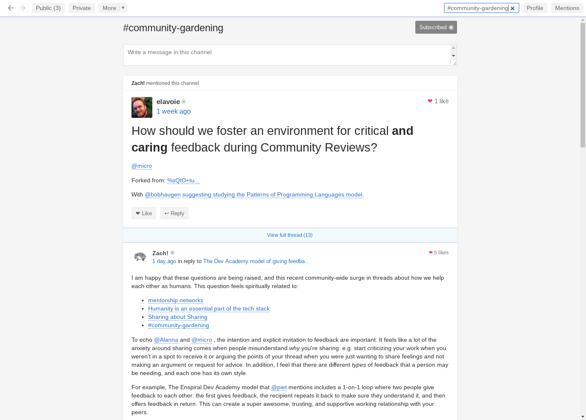

???

---
class: center, title

# app: Patchbay

GitHub: https://github.com/ssbc/patchbay

git-ssb: ssb://%s9mSFATE4RGyJx9wgH22lBrvD4CgUQW4yeguSWWjtqc=.sha256

???

moving to the next ship sailing in our archeapalego: Patchbay

---
class: center, no-margin

### app: Patchbay

???

here's Mix, the current lead maintainer

---
class: center, no-margin

### app: Patchbay

???

---
class: center, no-margin

### app: Patchbay

???

---
class: center, no-margin

### app: Patchbay

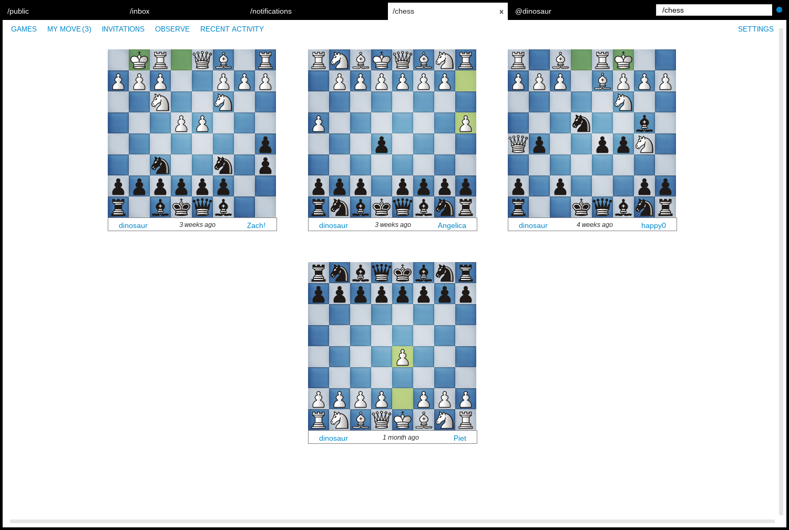

???

---
class: center, no-margin

### app: Patchbay

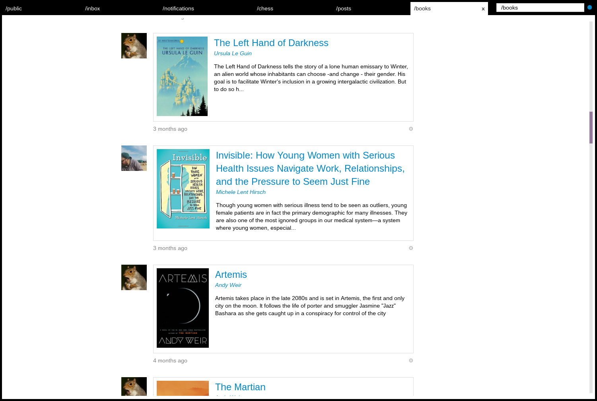

???

---
class: center, no-margin

### app: Patchbay

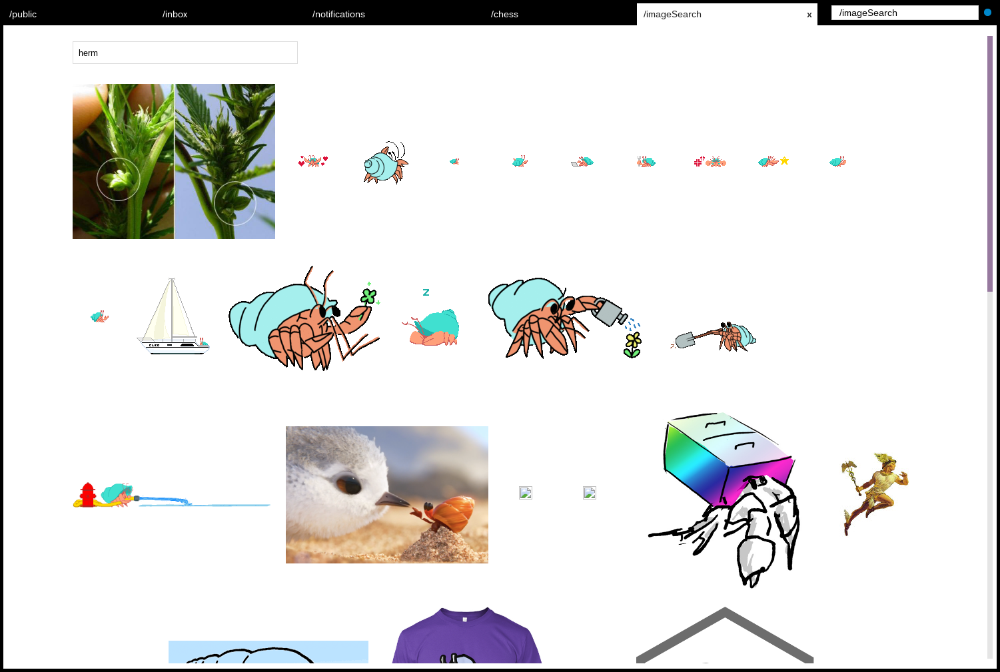

???

---
class: center, no-margin

### app: Patchbay

???

---
class: center, title

# app: [mmmmmm](https://gitlab.com/staltz/mmmmm-mobile)

???

GitHub: https://github.com/staltz/mmmmm-mobile

---
class: center, no-margin

### app: mmmmmm

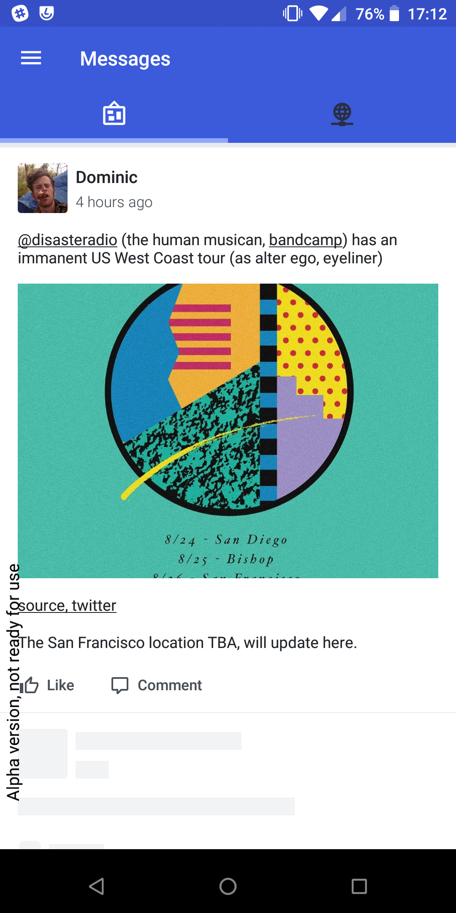

---
class: center, no-margin

### app: mmmmmm

---
class: center, no-margin

### app: mmmmmm

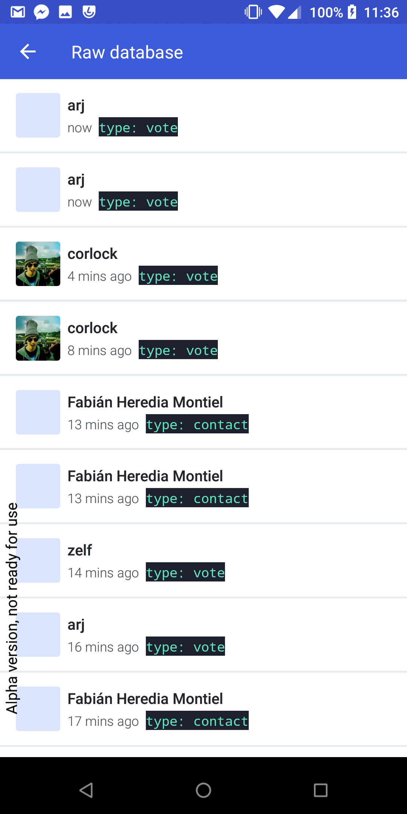

---
class: center, title

# app: scuttle-shell

GitHub: https://github.com/ssbc/scuttle-shell

???

a cute system tray application for an always-running Scuttlebutt server

---
class: center, no-margin

## app: [patchfox](https://github.com/soapdog/patchfox)

TODO

---
class: center, no-margin

## app: [patchless](https://github.com/patchless/patchless)

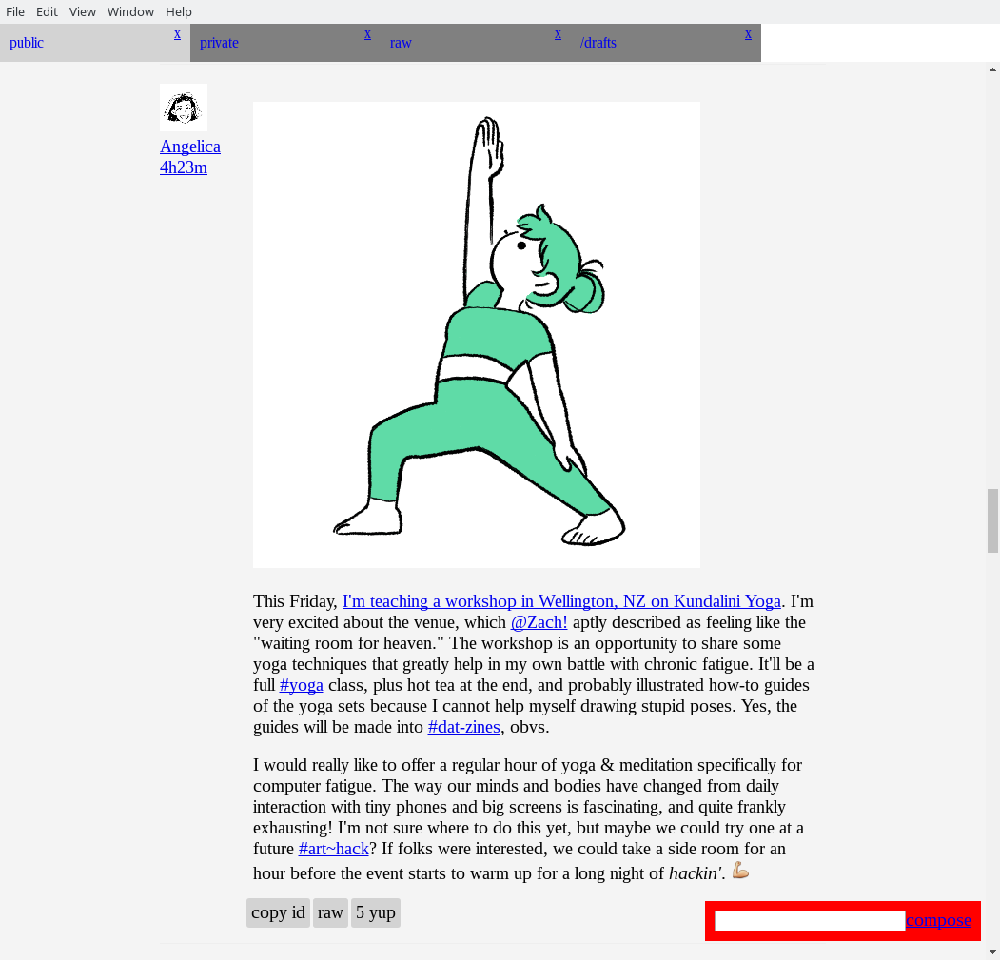

---
class: center, no-margin

## app: [ticktack](https://github.com/ticktackim)

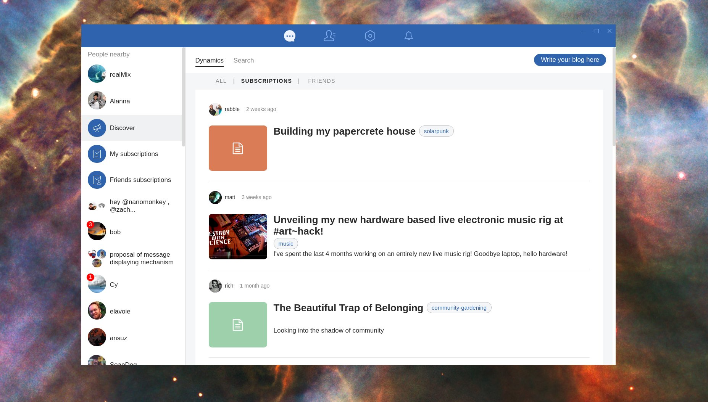

???

blogging app

---

## app: [tale:net](https://t4l3.net/)

???

skill sharing and ideation app

---
class: center, no-margin

## app: [scat](https://github.com/stripedpajamas/scat)

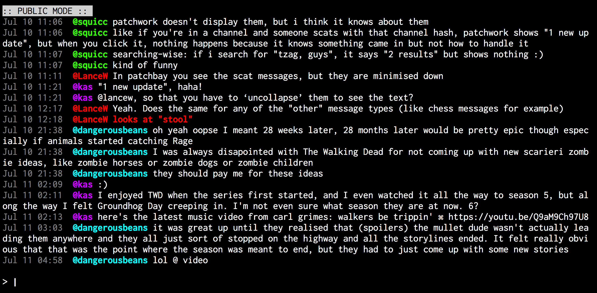

???

chat app

---
class: center, no-margin

## app: [ngx-ssb-client](https://github.com/datenknoten/ngx-ssb-client)

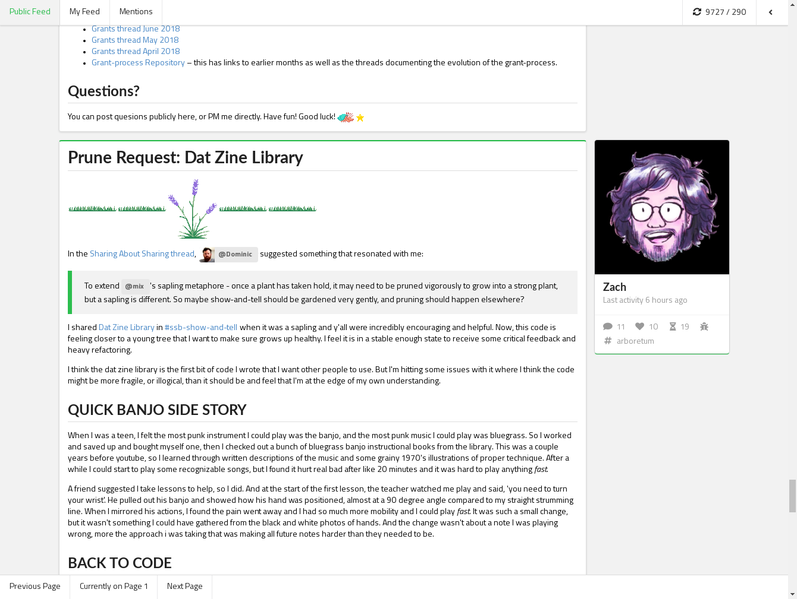

???

angular app

---
class: center, no-margin

## app: [ngx-ssb-client](https://github.com/datenknoten/ngx-ssb-client)

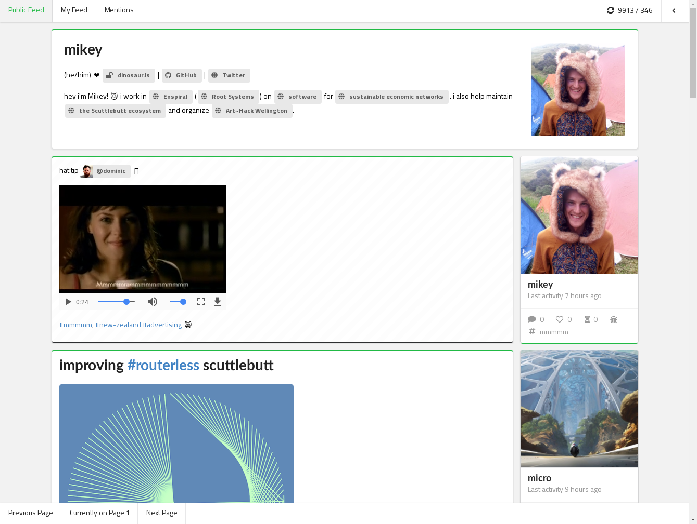

---
class: center, no-margin

## app: recipes

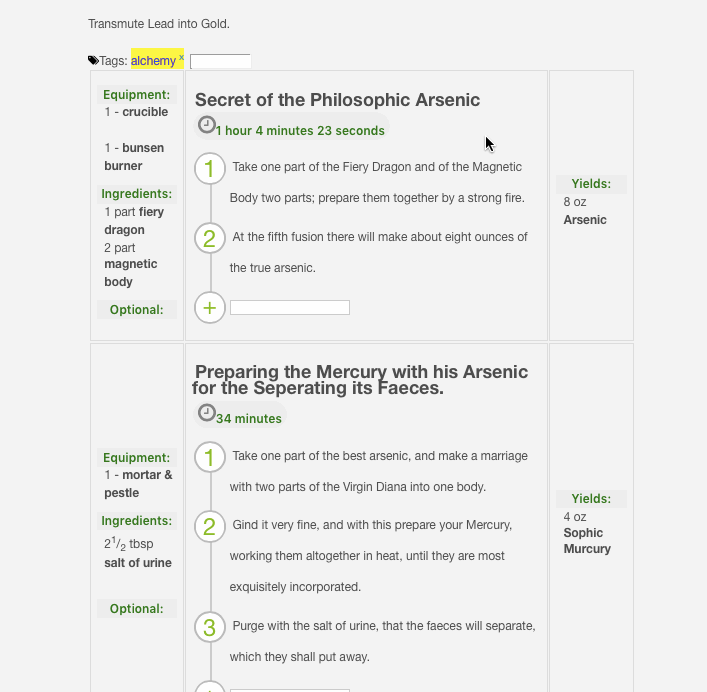

([%6ZmujAEWSxaNo5olG+gPoUq/pLrD5iPBdvoBuy8AHPg=.sha256](https://viewer.scuttlebot.io/%256ZmujAEWSxaNo5olG%2BgPoUq%2FpLrD5iPBdvoBuy8AHPg%3D.sha256))

---
class: center, no-margin

## app: [mvd](http://gitmx.com/)

???

GitHub: https://github.com/evbogue/mvd

git-ssb-web: http://git-ssb.celehner.com/%25NPNNvcnTMZUFZSWl%2F2Z4XX%2BYSdqsqOhyPacp%2BlgpQUw%3D.sha256

git-ssb: ssb://%NPNNvcnTMZUFZSWl/2Z4XX+YSdqsqOhyPacp+lgpQUw=.sha256

---

## lib: [rust](https://github.com/ssbc/ssb-client-rs)

???

---

## lib: [go](TODO)

???

---

## lib: [c](http://git-ssb.celehner.com/%254w0BO1KXW%2B6zBSJlQx1YViQeknl16anzhesmwKGRh2g%3D.sha256)

???

git-ssb: ssb://%4w0BO1KXW+6zBSJlQx1YViQeknl16anzhesmwKGRh2g=.sha256

---
class: center, no-margin

## stats: [graphviz](https://github.com/ssbc/ssb-graphviz)

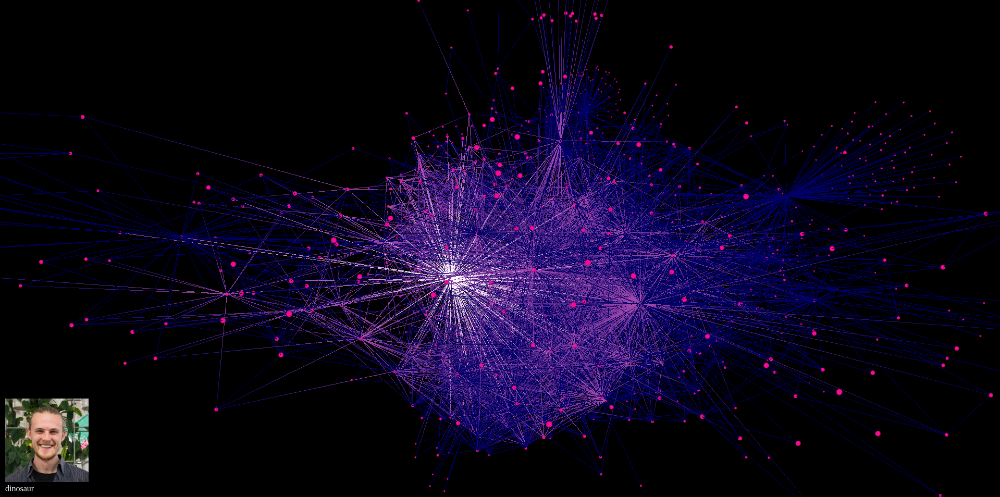

???

this screenshot was taken over a year ago

---
class: center, no-margin

## stats: gephi w/ @vtduncan

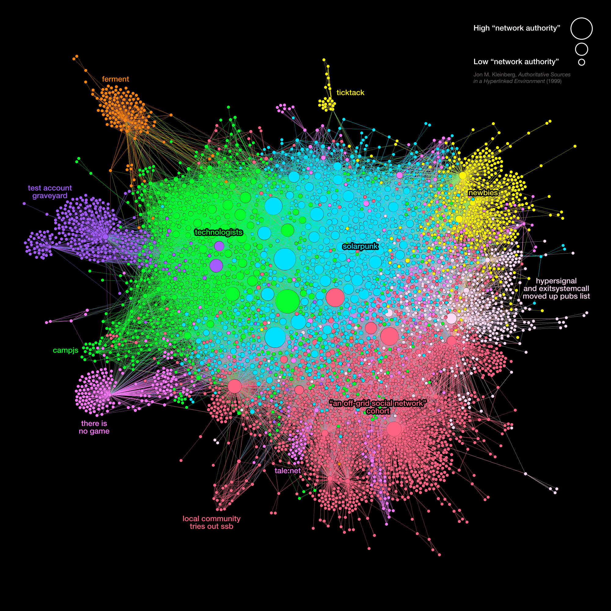

([%utUlBefFYqHWcFQaz4r5bZUil9YtYyTik1j6d7ymVyE=.sha256](https://viewer.scuttlebot.io/%25utUlBefFYqHWcFQaz4r5bZUil9YtYyTik1j6d7ymVyE%3D.sha256))

---
class: center, no-margin

## stats: gephi w/ @vtduncant

([%utUlBefFYqHWcFQaz4r5bZUil9YtYyTik1j6d7ymVyE=.sha256](https://viewer.scuttlebot.io/%25utUlBefFYqHWcFQaz4r5bZUil9YtYyTik1j6d7ymVyE%3D.sha256))

---
class: center, no-margin

## stats: gephi w/ @vtduncan

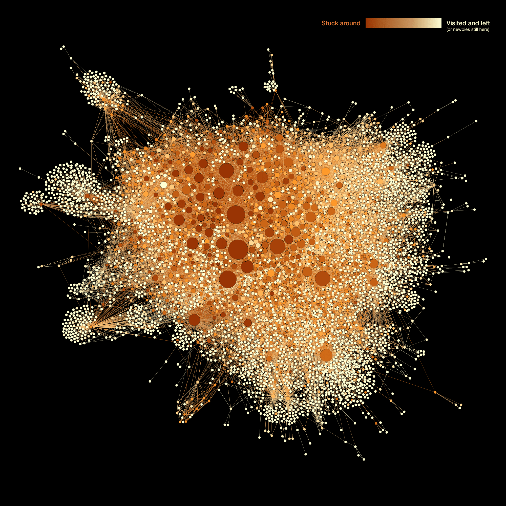

([%utUlBefFYqHWcFQaz4r5bZUil9YtYyTik1j6d7ymVyE=.sha256](https://viewer.scuttlebot.io/%25utUlBefFYqHWcFQaz4r5bZUil9YtYyTik1j6d7ymVyE%3D.sha256))

---
class: center, no-margin

## stats: gephi w/ @andrestaltz

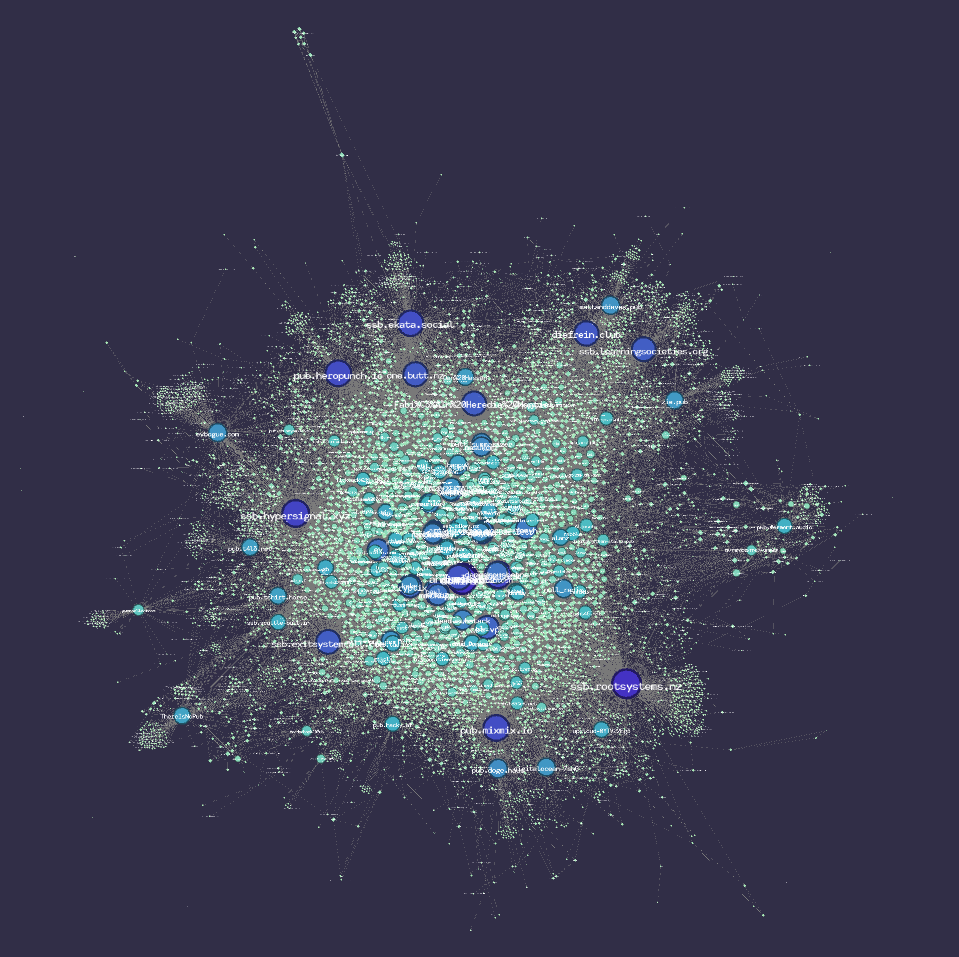

([%exTkaDhz4lhTWXmPV5Ln6/KZ7edLY/OE8A01a6XF2ns=.sha256](https://viewer.scuttlebot.io/%25exTkaDhz4lhTWXmPV5Ln6%2FKZ7edLY%2FOE8A01a6XF2ns%3D.sha256))

---
class: center, no-margin

## stats: gephi w/ @mix

---
class: center, no-margin

## guide: [Scuttlebutt protocol guide](https://ssbc.github.io/scuttlebutt-protocol-guide/)

---
class: center, no-margin

## guide: [Scuttlebutt protocol guide](https://ssbc.github.io/scuttlebutt-protocol-guide/)

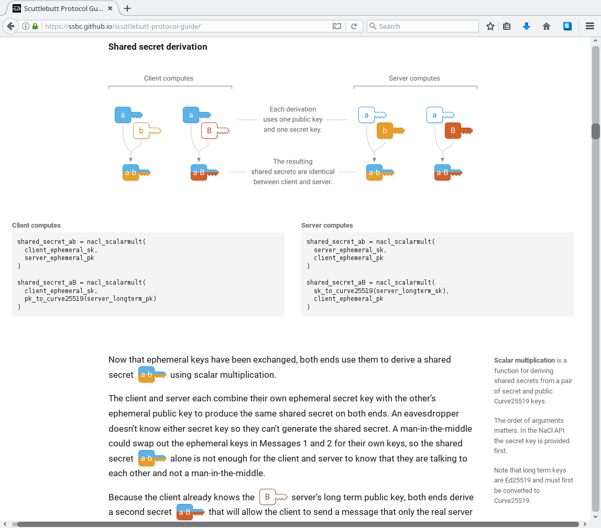

---
class: center, no-margin

## guide: [Scuttlebutt protocol guide](https://ssbc.github.io/scuttlebutt-protocol-guide/)

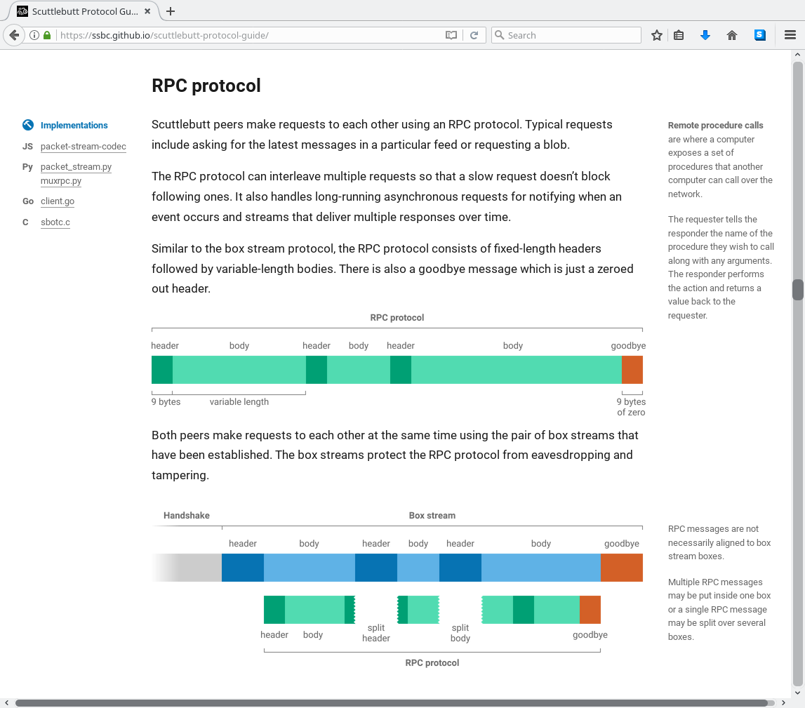

---
class: center, no-margin

## guide: [Scuttlebutt protocol guide](https://ssbc.github.io/scuttlebutt-protocol-guide/)

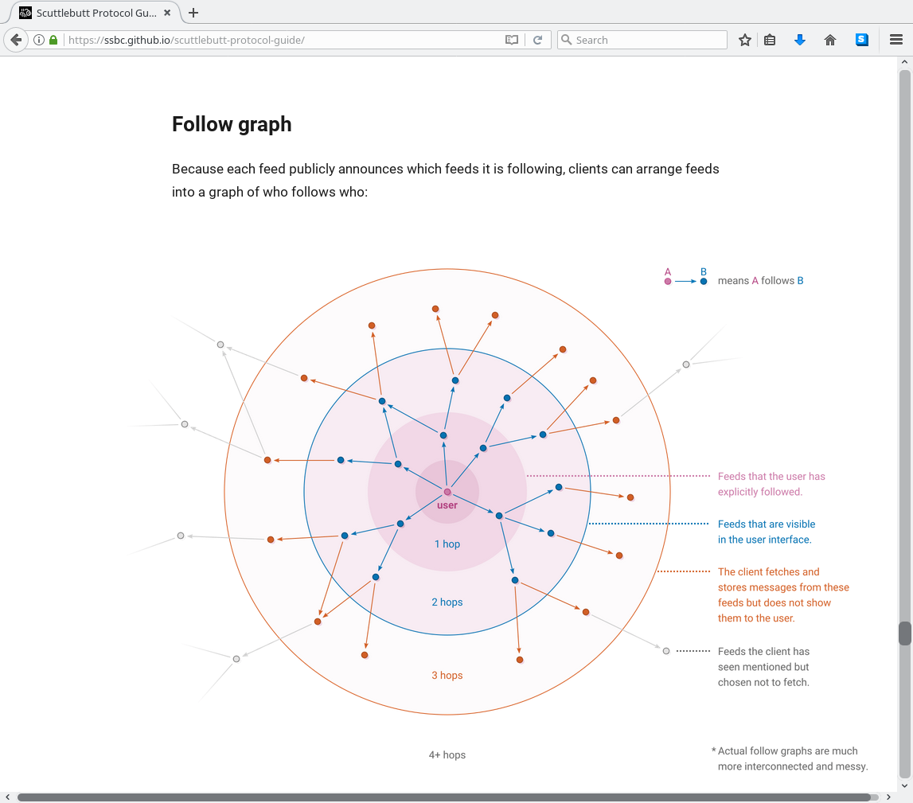

---
class: center, no-margin

## guide: [The Future Will Be Technical](https://coolguy.website/writing/the-future-will-be-technical)

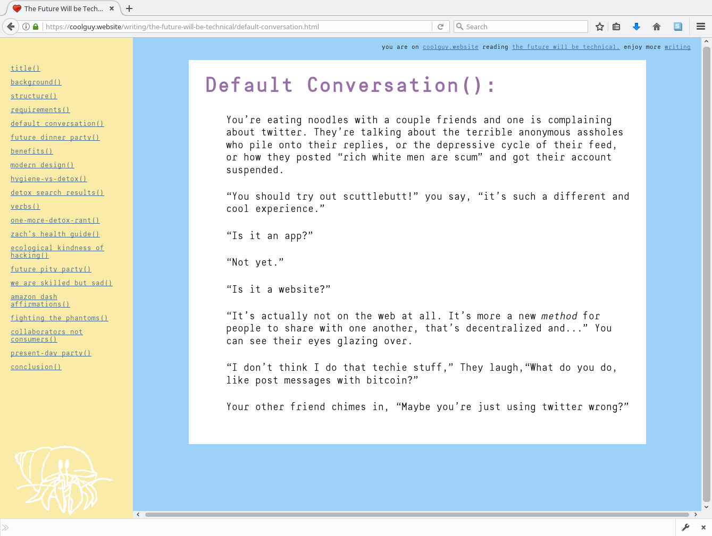

---
class: center, no-margin

## guide: [A Praise Chorus](dat://2295a89c2cdfb57ed91b135608627119199d5d834fbaede70a8713b2cedf6fe1/)

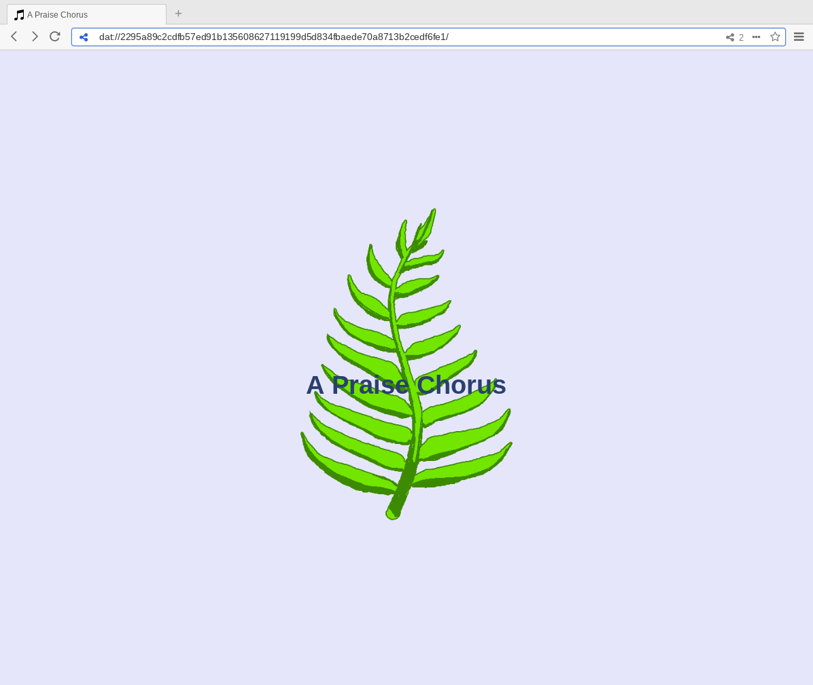

---
class: center, no-margin

## guide: [An Introduction to Scuttlebutt Development: Your Test Playground](https://josiahwitt.com/2018/07/08/scuttlebutt-intro-test-playground.html)

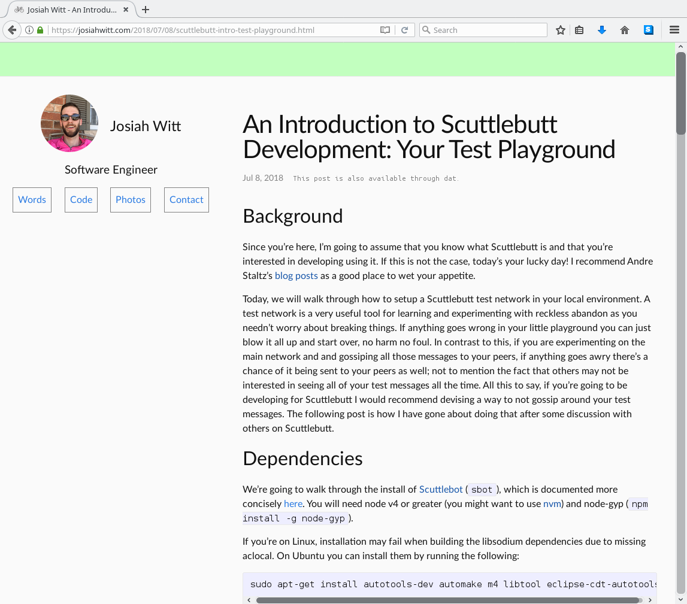

???

dat://wittjosiah.hashbase.io/2018/07/08/scuttlebutt-intro-test-playground.html

---

## guide: [An Introduction to Scuttlebutt Development: Flume & Plugins](https://josiahwitt.com/2018/07/08/scuttlebutt-intro-flume.html)

???

dat://wittjosiah.hashbase.io/2018/07/08/scuttlebutt-intro-flume.html

---

# thanks

